# I. Zadanie

## 0. Część "laboratoryjna"

### 0.0. Klasa *Product*

```
@Entity
public class Product {
    @Id
    @GeneratedValue(strategy = GenerationType.AUTO)
    private int id;

    private String productName;

    private int unitsOnStock;

    public int getId() {
        return id;
    }

    public String getProductName() {
        return productName;
    }

    public void setProductName(String productName) {
        this.productName = productName;
    }

    public int getUnitsOnStock() {
        return unitsOnStock;
    }

    public void setUnitsOnStock(int unitsOnStock) {
        this.unitsOnStock = unitsOnStock;
    }
}
```

Diagram bazy danych:

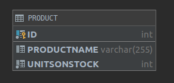

Tworzenie tabeli i wstawianie produktu w Hibernate:
```
Hibernate: 
create table Product (
       id integer not null,
        productName varchar(255),
        unitsOnStock integer not null,
        primary key (id)
    )

values
    next value for hibernate_sequence
Hibernate: 
    /* insert Product
        */ insert 
        into
            Product
            (productName, unitsOnStock, id) 
        values
            (?, ?, ?)
```

### 0.1. Product, Supplier i relacja jednostronna *isSuppliedBy* N:1

Modyfikujemy klasę *Product* o pole *supplier*:
```
    @ManyToOne
    @JoinColumn(name = "suppliedBy")
    private Supplier supplier;
```

I tworzymy nową klasę *Supplier*:
```
@Entity
public class Supplier {
    @Id
    @GeneratedValue(strategy = GenerationType.AUTO)
    private int id;

    private String companyName;

    private String street;

    private String city;

    public int getId() {
        return id;
    }

    public String getCompanyName() {
        return companyName;
    }

    public void setCompanyName(String companyName) {
        this.companyName = companyName;
    }

    public String getStreet() {
        return street;
    }

    public void setStreet(String street) {
        this.street = street;
    }

    public String getCity() {
        return city;
    }

    public void setCity(String city) {
        this.city = city;
    }
}
```

Zaktualizowany diagram:

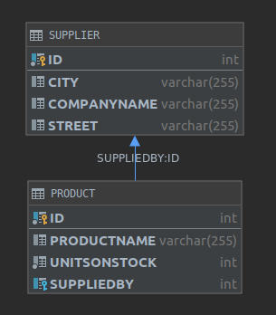

Tworzenie tabeli w Hibernate:
```
Hibernate: 
    
    create table Product (
       id integer not null,
        productName varchar(255),
        unitsOnStock integer not null,
        suppliedBy integer,
        primary key (id)
    )
Hibernate: 
    
    create table Supplier (
       id integer not null,
        city varchar(255),
        companyName varchar(255),
        street varchar(255),
        primary key (id)
    )
Hibernate: 
    
    alter table Product 
       add constraint FKrmje0fof2s5jl8e8vnhao98yv 
       foreign key (suppliedBy) 
       references Supplier
```

Wstawianie produktu i dostawcy do tabeli:
```
values
    next value for hibernate_sequence
Hibernate: 
    /* insert Product
        */ insert 
        into
            Product
            (productName, suppliedBy, unitsOnStock, id) 
        values
            (?, ?, ?, ?)
    
values
    next value for hibernate_sequence
Hibernate: 
    /* insert Supplier
        */ insert 
        into
            Supplier
            (city, companyName, street, id) 
        values
            (?, ?, ?, ?)
Hibernate: 
    /* update
        Product */ update
            Product 
        set
            productName=?,
            suppliedBy=?,
            unitsOnStock=? 
        where
            id=?
```

### 0.2. Product, Supplier i relacja jednostronna *supplies* 1:N

Modyfikujemy klasę *Supplier* o pole *suppliedProducts*:
```
    @OneToMany(cascade = CascadeType.ALL)
    @JoinColumn(name = "isSuppliedBy")
    private Set<Product> suppliedProducts;
```

W powyższym przypadku nie zostanie utworzona tabela łącznikowa - diagram pozostaje niezmieniony względem poprzedniego.

Wstawianie do bazy produktu i dostawcy:
```
Hibernate: 
    
values
    next value for hibernate_sequence
Hibernate: 
    /* insert Supplier
        */ insert 
        into
            Supplier
            (city, companyName, street, id) 
        values
            (?, ?, ?, ?)
Hibernate: 
    /* update
        Product */ update
            Product 
        set
            productName=?,
            unitsOnStock=? 
        where
            id=?
Hibernate: 
    /* create one-to-many row Supplier.suppliedProducts */ update
        Product 
    set
        isSuppliedBy=? 
    where
        id=?
```

Jeżeli chcemy utworzyć tabelę łącznikową usuwamy adnotacje `@JoinColumn`.

Tworzenie tabel w Hibernate:
```
Hibernate: 
    
    create table Product (
       id integer not null,
        productName varchar(255),
        unitsOnStock integer not null,
        primary key (id)
    )
Hibernate: 
    
    create table Supplier (
       id integer not null,
        city varchar(255),
        companyName varchar(255),
        street varchar(255),
        primary key (id)
    )
Hibernate: 
    
    create table Supplier_Product (
       Supplier_id integer not null,
        suppliedProducts_id integer not null,
        primary key (Supplier_id, suppliedProducts_id)
    )
Hibernate: 
    
    alter table Supplier_Product 
       add constraint UK_7hmgdnxj242yho08m9bgl92qv unique (suppliedProducts_id)
Hibernate: 
    
    alter table Supplier_Product 
       add constraint FKia4nldapnndua5t90wr8ilgwk 
       foreign key (suppliedProducts_id) 
       references Product
Hibernate: 
    
    alter table Supplier_Product 
       add constraint FK1gam671f3qabh6mhfhkav4g7s 
       foreign key (Supplier_id) 
       references Supplier
```

Diagram bazy danych:

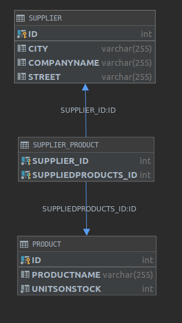

Wstawianie produktu i dostawcy:
```
Hibernate: 
    
values
    next value for hibernate_sequence
Hibernate: 
    /* insert Product
        */ insert 
        into
            Product
            (productName, unitsOnStock, id) 
        values
            (?, ?, ?)
    
values
    next value for hibernate_sequence
Hibernate: 
    /* insert Supplier
        */ insert 
        into
            Supplier
            (city, companyName, street, id) 
        values
            (?, ?, ?, ?)
Hibernate: 
    /* update
        Product */ update
            Product 
        set
            productName=?,
            unitsOnStock=? 
        where
            id=?
Hibernate: 
    /* insert collection
        row Supplier.suppliedProducts */ insert 
        into
            Supplier_Product
            (Supplier_id, suppliedProducts_id) 
        values
            (?, ?)
```

### 0.3. Product, Supplier i relacja obustronna

Łączymy powyższe dwa podejścia:

W klasie *Supplier*:
```
    @OneToMany(cascade = CascadeType.ALL, mappedBy = "supplier")
    private Set<Product> suppliedProducts;
```

W klasie *Product*:
```
    @ManyToOne(cascade = CascadeType.ALL)
    @JoinColumn(name = "isSuppliedBy")
    private Supplier supplier;
```

Diagram bazy danych (podobny jak poprzednio):

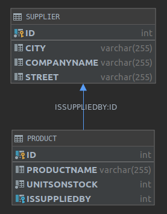

Kod wykonywanych zapytań SQLowych:
```
Hibernate: 
    
    create table Product (
       id integer not null,
        productName varchar(255),
        unitsOnStock integer not null,
        isSuppliedBy integer,
        primary key (id)
    )
Hibernate: 
    
    create table Supplier (
       id integer not null,
        city varchar(255),
        companyName varchar(255),
        street varchar(255),
        primary key (id)
    )
Hibernate: 
    
    alter table Product 
       add constraint FK91ulub91mkib84o6k5plu1221 
       foreign key (isSuppliedBy) 
       references Supplier
    
values
    next value for hibernate_sequence
Hibernate: 
    /* insert Product
        */ insert 
        into
            Product
            (productName, isSuppliedBy, unitsOnStock, id) 
        values
            (?, ?, ?, ?)
    
values
    next value for hibernate_sequence
Hibernate: 
    /* insert Supplier
        */ insert 
        into
            Supplier
            (city, companyName, street, id) 
        values
            (?, ?, ?, ?)
Hibernate: 
    /* update
        Product */ update
            Product 
        set
            productName=?,
            isSuppliedBy=?,
            unitsOnStock=? 
        where
            id=?
```

### 0.4. Dodanie klasy *Category* i relacja 1:N z *Product*

Tworzymy nową klasę:
```j
@Entity
public class Category {

    @Id
    @GeneratedValue(strategy = GenerationType.AUTO)
    private int categoryId;

    private String name;

    @OneToMany(cascade = CascadeType.ALL, mappedBy = "category")
    private List<Product> products;

    public Category() {
        this.products = new LinkedList<>();
    }

    public Category(String name) {
        this();
        this.name = name;
    }

    public int getCategoryId() {
        return categoryId;
    }

    public String getName() {
        return name;
    }

    public void setName(String name) {
        this.name = name;
    }

    public List<Product> getProducts() {
        return products;
    }

}
```

Modyfikujemy klasę *Product*:
```
    @ManyToOne
    @JoinColumn(name = "SUPPLIER_FK")
    private Supplier supplier;

    @ManyToOne
    @JoinColumn(name = "CATEGORY_FK")
    private Category category;
```

Aktualny diagram bazy danych:

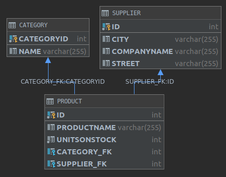

Tworzenie produktów i kategorii:
```
static void createExampleData() {
        Supplier drinksSupplier = new Supplier("Thirsty Company", "NY", "White Rd.");

        Category coffee = new Category("Coffee");
        Category tea = new Category("Tea");

        Product greenCoffee = new Product("Green Coffee", 0, drinksSupplier, coffee);
        Product blackCoffee = new Product("Black Coffee", 10, drinksSupplier, coffee);
        Product redTea = new Product("Red Tea", 20, drinksSupplier, tea);
        Product whiteTea = new Product("White Tea", 30, drinksSupplier, tea);

        try (Session session = util.HibernateUtil.getSession()) {
            Transaction transaction = session.beginTransaction();
            session.saveOrUpdate(drinksSupplier);
            session.saveOrUpdate(coffee);
            session.saveOrUpdate(tea);
            session.saveOrUpdate(greenCoffee);
            session.saveOrUpdate(blackCoffee);
            session.saveOrUpdate(redTea);
            session.saveOrUpdate(whiteTea);
            transaction.commit();
        }
    }
```

Wylistowanie produktów z wybranej kategorii oraz sprawdzenie kategorii do której należy produkt:
```
static void queryExampleCategoriesAndProducts() {
        try (Session session = util.HibernateUtil.getSession()) {

            Query categoryQuery = session.createQuery("from Category as C where C.name = 'Tea'");
            Category categoryFound = (Category) categoryQuery.list().get(0);
            if (categoryFound != null) {
                System.out.println(String.format("Category %s has products:", categoryFound.getName()));
                for (Product product : categoryFound.getProducts()) {
                    System.out.println(product.getProductName());
                }
            }

            Query productQuery = session.createQuery("from Product as P where P.productName = 'Red Tea'");
            Product productFound = (Product) productQuery.list().get(0);
            if (productFound != null) {
                System.out.println(MessageFormat.format("Product: {0} belong to category: {1}", productFound.getProductName(), productFound.getCategory().getName()));
            }

        }
    }
```

Output:
```
Category Tea has products:
Red Tea
White Tea

Product: Red Tea belong to category: Tea
```

Wykonane zapytania SQLowe:
```
Hibernate: 
    select
        products0_.CATEGORY_FK as CATEGORY4_1_0_,
        products0_.id as id1_1_0_,
        products0_.id as id1_1_1_,
        products0_.CATEGORY_FK as CATEGORY4_1_1_,
        products0_.productName as productN2_1_1_,
        products0_.SUPPLIER_FK as SUPPLIER5_1_1_,
        products0_.unitsOnStock as unitsOnS3_1_1_,
        supplier1_.id as id1_2_2_,
        supplier1_.city as city2_2_2_,
        supplier1_.companyName as companyN3_2_2_,
        supplier1_.street as street4_2_2_ 
    from
        Product products0_ 
    left outer join
        Supplier supplier1_ 
            on products0_.SUPPLIER_FK=supplier1_.id 
    where
        products0_.CATEGORY_FK=?


Hibernate: 
    /* 
from
    Product as P 
where
    P.productName = 'Red Tea' */ select
        product0_.id as id1_1_,
        product0_.CATEGORY_FK as CATEGORY4_1_,
        product0_.productName as productN2_1_,
        product0_.SUPPLIER_FK as SUPPLIER5_1_,
        product0_.unitsOnStock as unitsOnS3_1_ 
    from
        Product product0_ 
    where
        product0_.productName='Red Tea'
```

### 0.5. Relacja wiele-do-wielu N:N między klasami *Invoice* i *Product*

Tworzmy nową klasę *Invoice*:
```
@Entity
public class Invoice {
    @Id
    @GeneratedValue(strategy = GenerationType.AUTO)
    private int id;

    private int invoiceNumber;

    private int quantity;

    @ManyToMany(cascade = CascadeType.ALL)
    @JoinTable(
            name = "INVOICES_PRODUCTS",
            joinColumns = @JoinColumn(name = "INVOICE_ID"),
            inverseJoinColumns = @JoinColumn(name = "PRODUCT_ID"))
    private Set<Product> products;

    public Invoice() {
        this.products = new HashSet<>();
    }

    public Invoice(int invoiceNumber, int quantity) {
        this();
        this.invoiceNumber = invoiceNumber;
        this.quantity = quantity;
    }

    public int getId() {
        return id;
    }

    public int getInvoiceNumber() {
        return invoiceNumber;
    }

    public int getQuantity() {
        return quantity;
    }

    public Set<Product> getProducts() {
        return products;
    }
}
```

Aktualny diagram bazy danych:

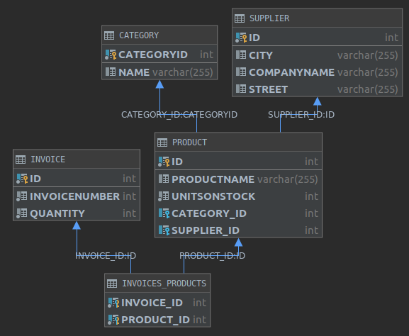

Modyfikujemy poprzednio utworzoną metodę `createExampleData` aby dodać kilka zrealizowanych transakcji:
```
static void createExampleData() {
        Invoice invoice1 = new Invoice(1, 20);
        Invoice invoice2 = new Invoice(2, 20);

        Supplier drinksSupplier = new Supplier("Thirsty Company", "NY", "White Rd.");

        Category coffee = new Category("Coffee");
        Category tea = new Category("Tea");

        Product greenCoffee = new Product("Green Coffee", 0, drinksSupplier, coffee);
        Product blackCoffee = new Product("Black Coffee", 10, drinksSupplier, coffee);
        Product redTea = new Product("Red Tea", 20, drinksSupplier, tea);
        Product whiteTea = new Product("White Tea", 30, drinksSupplier, tea);

        invoice1.getProducts().add(greenCoffee);
        invoice1.getProducts().add(redTea);

        invoice2.getProducts().add(blackCoffee);
        invoice2.getProducts().add(whiteTea);

        try (Session session = util.HibernateUtil.getSession()) {
            Transaction transaction = session.beginTransaction();

            session.saveOrUpdate(invoice1);
            session.saveOrUpdate(invoice2);

            session.saveOrUpdate(drinksSupplier);

            session.saveOrUpdate(coffee);
            session.saveOrUpdate(tea);

            session.saveOrUpdate(greenCoffee);
            session.saveOrUpdate(blackCoffee);
            session.saveOrUpdate(redTea);
            session.saveOrUpdate(whiteTea);

            transaction.commit();
        }
    }
```

Wylistowanie produktów sprzedanych w ramach wybranej faktury:
```
Query invoiceQuery = session.createQuery("from Invoice");
            Invoice firstInvoice = (Invoice) invoiceQuery.list().get(0);
            if (firstInvoice != null) {
                System.out.printf("Invoice with number: %d contains products:%n", firstInvoice.getInvoiceNumber());
                for (Product product : firstInvoice.getProducts()) {
                    System.out.println(product.getProductName());
                }
            }
```

Wylistowanie faktur w ramach których sprzedany był wybrany produkt:
```
Query productQuery = session.createQuery("from Product");
            Product firstProduct = (Product) productQuery.list().get(0);
            if (firstProduct != null) {
                System.out.printf("Product: %s was sold in invoices:%n", firstProduct.getProductName());
                for (Invoice invoice : firstProduct.getInvoices()) {
                    System.out.println(invoice.getInvoiceNumber());
                }
            }
```

Output:
```
Invoice with number: 1 contains products:
Green Coffee
Red Tea

Product: Green Coffee was sold in invoices:
1
```

Wykonywane zapytania SQLowe przy powyższych taskach:
```
Hibernate: 
    /* 
from
    Invoice */ select
        invoice0_.id as id1_1_,
        invoice0_.invoiceNumber as invoiceN2_1_,
        invoice0_.quantity as quantity3_1_ 
    from
        Invoice invoice0_

Hibernate: 
    select
        products0_.INVOICE_ID as INVOICE_1_2_0_,
        products0_.PRODUCT_ID as PRODUCT_2_2_0_,
        product1_.id as id1_3_1_,
        product1_.CATEGORY_ID as CATEGORY4_3_1_,
        product1_.productName as productN2_3_1_,
        product1_.SUPPLIER_ID as SUPPLIER5_3_1_,
        product1_.unitsOnStock as unitsOnS3_3_1_,
        category2_.categoryId as category1_0_2_,
        category2_.name as name2_0_2_,
        supplier3_.id as id1_4_3_,
        supplier3_.city as city2_4_3_,
        supplier3_.companyName as companyN3_4_3_,
        supplier3_.street as street4_4_3_ 
    from
        INVOICES_PRODUCTS products0_ 
    inner join
        Product product1_ 
            on products0_.PRODUCT_ID=product1_.id 
    left outer join
        Category category2_ 
            on product1_.CATEGORY_ID=category2_.categoryId 
    left outer join
        Supplier supplier3_ 
            on product1_.SUPPLIER_ID=supplier3_.id 
    where
        products0_.INVOICE_ID=?

Hibernate: 
    /* 
from
    Product */ select
        product0_.id as id1_3_,
        product0_.CATEGORY_ID as CATEGORY4_3_,
        product0_.productName as productN2_3_,
        product0_.SUPPLIER_ID as SUPPLIER5_3_,
        product0_.unitsOnStock as unitsOnS3_3_ 
    from
        Product product0_

Hibernate: 
    select
        invoices0_.PRODUCT_ID as PRODUCT_2_2_0_,
        invoices0_.INVOICE_ID as INVOICE_1_2_0_,
        invoice1_.id as id1_1_1_,
        invoice1_.invoiceNumber as invoiceN2_1_1_,
        invoice1_.quantity as quantity3_1_1_ 
    from
        INVOICES_PRODUCTS invoices0_ 
    inner join
        Invoice invoice1_ 
            on invoices0_.INVOICE_ID=invoice1_.id 
    where
        invoices0_.PRODUCT_ID=?
```

## 1. JPA

Tworzymy nowy plik z konfiguracją JPA w `META-INF/persistence.xml`:
```
<?xml version="1.0" encoding="UTF-8" ?>
<persistence xmlns="http://java.sun.com/xml/ns/persistence"
             xmlns:xsi="http://www.w3.org/2001/XMLSchema-instance"
             xsi:schemaLocation="http://java.sun.com/xml/ns/persistence http://java.sun.com/xml/ns/persistence/persistence_2_0.xsd"
             version="2.0">
    <persistence-unit name="DerbyDatabaseJPAConfig" transaction-type="RESOURCE_LOCAL">
        <properties>
            <property name="hibernate.connection.driver_class" value="org.apache.derby.jdbc.ClientDriver"/>
            <property name="hibernate.connection.url" value="jdbc:derby://localhost:1527/DerbyDatabase"/>
            <property name="hibernate.show_sql" value="true"/>
            <property name="hibernate.format_sql" value="true"/>
            <property name="hibernate.hbm2ddl.auto" value="create"/>
        </properties>
    </persistence-unit>
</persistence>
```

Nowo utworzony `JPAMain`:
```
public class JPAMain {
    private static EntityManagerFactory entityManagerFactory = Persistence.createEntityManagerFactory("DerbyDatabaseJPAConfig");

    public static void main(String[] args) {
        createExampleData();
        queryCategories();
        queryProducts();
    }

    private static void createExampleData() {
        Supplier drinksSupplier = new Supplier("Thirsty Company", "NY", "White Rd.");

        Category coffee = new Category("Coffee");
        Category tea = new Category("Tea");

        Product greenCoffee = new Product("Green Coffee", 0, drinksSupplier, coffee);
        Product blackCoffee = new Product("Black Coffee", 10, drinksSupplier, coffee);
        Product redTea = new Product("Red Tea", 20, drinksSupplier, tea);
        Product whiteTea = new Product("White Tea", 30, drinksSupplier, tea);


        EntityManager entityManager = entityManagerFactory.createEntityManager();
        EntityTransaction tx = entityManager.getTransaction();
        tx.begin();

        entityManager.persist(drinksSupplier);

        entityManager.persist(coffee);
        entityManager.persist(tea);

        entityManager.persist(greenCoffee);
        entityManager.persist(blackCoffee);
        entityManager.persist(redTea);
        entityManager.persist(whiteTea);

        tx.commit();
        entityManager.close();
    }

    private static void queryCategories() {
        EntityManager entityManager = entityManagerFactory.createEntityManager();
        List<Category> categories = entityManager.createQuery("from Category").getResultList();

        for (Category category : categories) {
            System.out.println("Products from category: " + category.getName());
            for (Product product : category.getProducts())
                System.out.println(product.getProductName());
        }

        entityManager.close();
    }

    private static void queryProducts() {
        EntityManager entityManager = entityManagerFactory.createEntityManager();
        List<Product> products = entityManager.createQuery("from Product").getResultList();

        for (Product product : products) {
            System.out.println(product.getProductName() + " is from category " + product.getCategory().getName());
        }

        entityManager.close();
    }
}
```

Output:
```
Products from category: Coffee
Green Coffee
Black Coffee
Products from category: Tea
Red Tea
White Tea

Green Coffee is from category Coffee
Black Coffee is from category Coffee
Red Tea is from category Tea
White Tea is from category Tea
```

Diagram baz danych w tym podpunkcie się nie zmienił.

Logi wywołań SQLowych (podczas listowania kategorii i produktów):
```
Hibernate: 
    select
        category0_.categoryId as category1_0_,
        category0_.name as name2_0_ 
    from
        Category category0_

Hibernate: 
    select
        products0_.CATEGORY_ID as CATEGORY4_3_0_,
        products0_.id as id1_3_0_,
        products0_.id as id1_3_1_,
        products0_.CATEGORY_ID as CATEGORY4_3_1_,
        products0_.productName as productN2_3_1_,
        products0_.SUPPLIER_ID as SUPPLIER5_3_1_,
        products0_.unitsOnStock as unitsOnS3_3_1_,
        supplier1_.id as id1_4_2_,
        supplier1_.city as city2_4_2_,
        supplier1_.companyName as companyN3_4_2_,
        supplier1_.street as street4_4_2_ 
    from
        Product products0_ 
    left outer join
        Supplier supplier1_ 
            on products0_.SUPPLIER_ID=supplier1_.id 
    where
        products0_.CATEGORY_ID=?

Hibernate: 
    select
        products0_.CATEGORY_ID as CATEGORY4_3_0_,
        products0_.id as id1_3_0_,
        products0_.id as id1_3_1_,
        products0_.CATEGORY_ID as CATEGORY4_3_1_,
        products0_.productName as productN2_3_1_,
        products0_.SUPPLIER_ID as SUPPLIER5_3_1_,
        products0_.unitsOnStock as unitsOnS3_3_1_,
        supplier1_.id as id1_4_2_,
        supplier1_.city as city2_4_2_,
        supplier1_.companyName as companyN3_4_2_,
        supplier1_.street as street4_4_2_ 
    from
        Product products0_ 
    left outer join
        Supplier supplier1_ 
            on products0_.SUPPLIER_ID=supplier1_.id 
    where
        products0_.CATEGORY_ID=?

Hibernate: 
    select
        product0_.id as id1_3_,
        product0_.CATEGORY_ID as CATEGORY4_3_,
        product0_.productName as productN2_3_,
        product0_.SUPPLIER_ID as SUPPLIER5_3_,
        product0_.unitsOnStock as unitsOnS3_3_ 
    from
        Product product0_
Hibernate: 
    select
        category0_.categoryId as category1_0_0_,
        category0_.name as name2_0_0_ 
    from
        Category category0_ 
    where
        category0_.categoryId=?
Hibernate: 
    select
        supplier0_.id as id1_4_0_,
        supplier0_.city as city2_4_0_,
        supplier0_.companyName as companyN3_4_0_,
        supplier0_.street as street4_4_0_ 
    from
        Supplier supplier0_ 
    where
        supplier0_.id=?
Hibernate: 
    select
        category0_.categoryId as category1_0_0_,
        category0_.name as name2_0_0_ 
    from
        Category category0_ 
    where
        category0_.categoryId=?
```

## 2. Cascades

Wprowadzamy modyfikacje, aby możliwe było kaskadowe tworzenie *Invoice* wraz z nowymi produktami oraz kaskadowe tworzenie *Product* wraz z nową fakturą.

We wcześniejszych przykładach zaplikowaliśmy już kaskadowe tworzenie encji przy pomocy użytego paramatru adnotacji: `CascadeType.ALL`

`CascadeType.ALL` propaguje hierarchicznie wszystkie rodzaje operacji z encji rodzica do encji dziecka.

`CascadeType.PERSIST` propaguje w dół operacje persystencji.
Oznacza to, że chcąc zapisać encję A odwołującej się do encji B - encja B zostanie także zapisana.

`CascadeType.SAVE_UPDATE` propaguje w dół operację zapisu `save(), update(), saveOrUpdate()`

Modyfikujemy na potrzeby tego punktu klasy *Product*:
```
@ManyToOne(cascade = CascadeType.ALL)
    @JoinColumn(name = "SUPPLIER_ID")
    private Supplier supplier;

    @ManyToOne(cascade = CascadeType.ALL)
    @JoinColumn(name = "CATEGORY_ID")
    private Category category;
```

Oraz *Invoice*:
```
@ManyToMany(cascade = CascadeType.ALL)
    @JoinTable(
            name = "INVOICES_PRODUCTS",
            joinColumns = @JoinColumn(name = "INVOICE_ID"),
            inverseJoinColumns = @JoinColumn(name = "PRODUCT_ID"))
    private Set<Product> products;
```

Następnie tworzymy metodę która umożliwi sprawdzenie czy zapis faktury automatycznie spowoduje zapis produktów w niej zawartych:
```
static void createExampleDataCascadeTest() {
        Supplier fishSupplier = new Supplier("Wet Company", "Salmon Rd.", "LA");
        Category fish = new Category("Fish");
        Invoice invoice = new Invoice(1, 20);

        Product[] products = {
                new Product("Tuna", 10, fishSupplier, fish),
                new Product("Shark", 10, fishSupplier, fish),
                new Product("Dolphin", 10, fishSupplier, fish)
        };

        invoice.getProducts().addAll(Arrays.asList(products));

        try (Session session = HibernateUtil.getSession()) {
            Transaction transaction = session.beginTransaction();
            session.saveOrUpdate(invoice);
            transaction.commit();
        }
    }
```

Widzimy że do bazy zapisane zostały wszystkie encje (produkty, dostawca, kategoria, faktura), mimo że jawnie zapisaliśmy tylko `invoice`:
```
Hibernate: 
    /* insert Invoice
        */ insert 
        into
            Invoice
            (invoiceNumber, quantity, id) 
        values
            (?, ?, ?)
Hibernate: 
    /* insert Category
        */ insert 
        into
            Category
            (name, categoryId) 
        values
            (?, ?)
Hibernate: 
    /* insert Supplier
        */ insert 
        into
            Supplier
            (city, companyName, street, id) 
        values
            (?, ?, ?, ?)
Hibernate: 
    /* insert Product
        */ insert 
        into
            Product
            (CATEGORY_ID, productName, SUPPLIER_ID, unitsOnStock, id) 
        values
            (?, ?, ?, ?, ?)
Hibernate: 
    /* insert Product
        */ insert 
        into
            Product
            (CATEGORY_ID, productName, SUPPLIER_ID, unitsOnStock, id) 
        values
            (?, ?, ?, ?, ?)
Hibernate: 
    /* insert Product
        */ insert 
        into
            Product
            (CATEGORY_ID, productName, SUPPLIER_ID, unitsOnStock, id) 
        values
            (?, ?, ?, ?, ?)
Hibernate: 
    /* insert collection
        row Invoice.products */ insert 
        into
            INVOICES_PRODUCTS
            (INVOICE_ID, PRODUCT_ID) 
        values
            (?, ?)
Hibernate: 
    /* insert collection
        row Invoice.products */ insert 
        into
            INVOICES_PRODUCTS
            (INVOICE_ID, PRODUCT_ID) 
        values
            (?, ?)
Hibernate: 
    /* insert collection
        row Invoice.products */ insert 
        into
            INVOICES_PRODUCTS
            (INVOICE_ID, PRODUCT_ID) 
        values
            (?, ?)
```

Następnie modyfikujemy klasę *Product*:
```
    @ManyToMany(mappedBy = "products", cascade = CascadeType.ALL)
    private Set<Invoice> invoices;
```

Testujemy czy zapis produktu `product` zadziała podobnie:
```
static void createExampleDataCascadeTestProduct() {
        Supplier fishSupplier = new Supplier("Wet Company", "Salmon Rd.", "LA");
        Category fish = new Category("Fish");
        Product product = new Product("Tuna", 10, fishSupplier, fish);

        Invoice[] invoices = {
                new Invoice(1, 10),
                new Invoice(2, 10),
                new Invoice(3, 10),
        };

        product.getInvoices().addAll(Arrays.asList(invoices));

        try (Session session = HibernateUtil.getSession()) {
            Transaction transaction = session.beginTransaction();
            session.saveOrUpdate(product);
            transaction.commit();
        }
    }
```

Wynik jak się spodziewano:
```
Hibernate: 
    /* insert Category
        */ insert 
        into
            Category
            (name, categoryId) 
        values
            (?, ?)
Hibernate: 
    /* insert Supplier
        */ insert 
        into
            Supplier
            (city, companyName, street, id) 
        values
            (?, ?, ?, ?)
Hibernate: 
    /* insert Product
        */ insert 
        into
            Product
            (CATEGORY_ID, productName, SUPPLIER_ID, unitsOnStock, id) 
        values
            (?, ?, ?, ?, ?)
Hibernate: 
    /* insert Invoice
        */ insert 
        into
            Invoice
            (invoiceNumber, quantity, id) 
        values
            (?, ?, ?)
Hibernate: 
    /* insert Invoice
        */ insert 
        into
            Invoice
            (invoiceNumber, quantity, id) 
        values
            (?, ?, ?)
Hibernate: 
    /* insert Invoice
        */ insert 
        into
            Invoice
            (invoiceNumber, quantity, id) 
        values
            (?, ?, ?)
```

Wniosek: `CascadeType.ALL` umożliwia propagowanie persystowania obiektów w dół hierarchii klas.

## 3. Embedded class

Do dalszej części wykorzystujemy bibliotekę `Lombok` która pozwala na automatyczną generację konstruktorów, getterów i setterów.

Tworzymy klasę *Address* wykorzystując adnotację `@Embeddable`
```
@Embeddable
@Data
@NoArgsConstructor
@AllArgsConstructor
public class Address {
    private String city;
    private String street;
}
```

Wprowadzamy modyfikacje w klasie *Supplier*:
```
@Entity
@Data
public class Supplier {
    @Id
    @GeneratedValue(strategy = GenerationType.AUTO)
    private int id;

    @Embedded
    @AttributeOverrides(value = {
            @AttributeOverride(name = "city", column = @Column(name = "officeCity")),
            @AttributeOverride(name = "street", column = @Column(name = "officeStreet")),
    })
    private Address address;

    private String companyName;

    @OneToMany(cascade = CascadeType.ALL, mappedBy = "supplier")
    private Set<Product> suppliedProducts;

    public Supplier() {
        this.suppliedProducts = new HashSet<>();
    }

    public Supplier(String companyName, Address address) {
        this.companyName = companyName;
        this.address = address;
    }
}
```

Powyżej dodane adnotacje `@AttributeOverrides` są opcjonalne i służą jedynie zamianie nazw kolumn dodanych do tabeli *Suppliers*. 

W wygenerowanej bazie danych według nich zostały nazwane pola:

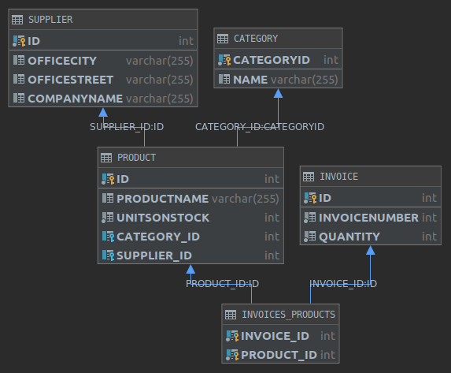

Dodawanie dostawcy z 'nowym' adresem:
```
static void createSupplierWithAddress() {
        Address address = new Address("Los Angeles", "Hot Street");
        Supplier supplier = new Supplier("InPostPaczkomaty", address);

        try (Session session = HibernateUtil.getSession()) {
            Transaction transaction = session.beginTransaction();
            session.saveOrUpdate(supplier);
            transaction.commit();
        }
    }
```

Logi zapytań SQLowych z tworzenia tabeli i z tej operacji:
```
Hibernate: 
    
    create table Supplier (
       id integer not null,
        officeCity varchar(255),
        officeStreet varchar(255),
        companyName varchar(255),
        primary key (id)
    )

values
    next value for hibernate_sequence
Hibernate: 
    /* insert Supplier
        */ insert 
        into
            Supplier
            (officeCity, officeStreet, companyName, id) 
        values
            (?, ?, ?, ?)
```

## 4. Inheritance

### 4.1. @MappedSuperclass

Pierwsza opcja - dziedziczenie jest widoczne tylko w klasie ale nie w modelu bazodanowym.

Klasa bazowa:
```
@MappedSuperclass
@Data
public abstract class Company {
    @Id
    @GeneratedValue
    protected int id;

    protected String companyName;

    protected String street;

    protected String city;

    protected String zipCode;
}
```

Klasy dziedziczące:
```
@Entity
@Data
@EqualsAndHashCode(callSuper = true)
public class CompanyCustomer extends Company {
    private Double discount;
}

@Entity
@Data
@EqualsAndHashCode(callSuper = true)
public class CompanySupplier extends Company {
    private String bankAccountNumber;
}
```

Wada: klasy bazowe nie mogą mieć powiązań z innymi encjami z bazy.

### 4.2. Single Table

Jedna tabela na całą hierarchię dziedziczenia:

```
@Data
@Entity
@Inheritance(strategy = InheritanceType.SINGLE_TABLE)
public abstract class Company {
    @Id
    @GeneratedValue
    protected int id;

    protected String companyName;

    protected String street;

    protected String city;

    protected String zipCode;
}
```

```
@Entity
@Data
@EqualsAndHashCode(callSuper = true)
public class CompanyCustomer extends Company {
    private Double discount;
}
```

```
@Entity
@Data
@EqualsAndHashCode(callSuper = true)
public class CompanySupplier extends Company {
    private String bankAccountNumber;
}
```

Diagram bazy danych

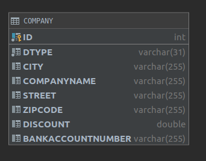

Powyżej widzimy że utworzona została dodatkowa kolumna DTYPE.

Kod:
```
static void createCompaniesSingleTable() {
        CompanyCustomer companyCustomer = new CompanyCustomer();
        companyCustomer.setDiscount(0.50);
        companyCustomer.setCity("Kraków");
        companyCustomer.setStreet("Budryka");
        companyCustomer.setCompanyName("Administracja DS Kapitol");
        companyCustomer.setZipCode("30-072");

        CompanySupplier companySupplier = new CompanySupplier();
        companySupplier.setBankAccountNumber("111144442222555599992222");
        companySupplier.setCity("Warszawa");
        companySupplier.setStreet("Polna");
        companySupplier.setCompanyName("Sejm RP");
        companySupplier.setZipCode("30-072");

        try (Session session = HibernateUtil.getSession()) {
            Transaction transaction = session.beginTransaction();
            session.saveOrUpdate(companyCustomer);
            session.saveOrUpdate(companySupplier);
            transaction.commit();
        }
    }
```

SQL podczas tworzenia tabeli i tworzenia encji obu subklas:
```
Hibernate:     
    create table Company (
       DTYPE varchar(31) not null,
        id integer not null,
        city varchar(255),
        companyName varchar(255),
        street varchar(255),
        zipCode varchar(255),
        discount double,
        bankAccountNumber varchar(255),
        primary key (id)
    )

Hibernate: 
    /* insert inheritance.singleTable.CompanyCustomer
        */ insert 
        into
            Company
            (city, companyName, street, zipCode, discount, DTYPE, id) 
        values
            (?, ?, ?, ?, ?, 'CompanyCustomer', ?)

Hibernate: 
    /* insert inheritance.singleTable.CompanySupplier
        */ insert 
        into
            Company
            (city, companyName, street, zipCode, bankAccountNumber, DTYPE, id) 
        values
            (?, ?, ?, ?, ?, 'CompanySupplier', ?)
```

### 4.3. Joined Table

Tabele łączone.

Jedyna modyfikacja jaką wprowadzamy względem poprzedniej opcji to
`@Inheritance(strategy= InheritanceType.JOINED)` nad klasą *Company*

Diagram bazy danych

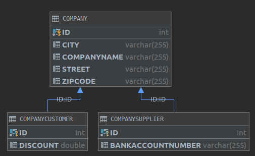

SQL podczas tworzenia tabeli i tworzenia encji obu subklas:
```
Hibernate: 
    
    create table Company (
       id integer not null,
        city varchar(255),
        companyName varchar(255),
        street varchar(255),
        zipCode varchar(255),
        primary key (id)
    )
Hibernate: 
    
    create table CompanyCustomer (
       discount double,
        id integer not null,
        primary key (id)
    )
Hibernate: 
    
    create table CompanySupplier (
       bankAccountNumber varchar(255),
        id integer not null,
        primary key (id)
    )
Hibernate: 
    
    alter table CompanyCustomer 
       add constraint FKpscejgcpnfbengpbv44utuxiq 
       foreign key (id) 
       references Company
Hibernate: 
    
    alter table CompanySupplier 
       add constraint FKd2temuipboo11u2fn0fyphhao 
       foreign key (id) 
       references Company

Hibernate: 
    /* insert inheritance.joinedTable.CompanyCustomer
        */ insert 
        into
            Company
            (city, companyName, street, zipCode, id) 
        values
            (?, ?, ?, ?, ?)
Hibernate: 
    /* insert inheritance.joinedTable.CompanyCustomer
        */ insert 
        into
            CompanyCustomer
            (discount, id) 
        values
            (?, ?)
Hibernate: 
    /* insert inheritance.joinedTable.CompanySupplier
        */ insert 
        into
            Company
            (city, companyName, street, zipCode, id) 
        values
            (?, ?, ?, ?, ?)
Hibernate: 
    /* insert inheritance.joinedTable.CompanySupplier
        */ insert 
        into
            CompanySupplier
            (bankAccountNumber, id) 
        values
            (?, ?)
```

### 4.4. Table-Per-Class

Tabela dla każdej klasy.

Jedyna modyfikacja jaką wprowadzamy względem poprzedniej opcji to
`@Inheritance(strategy= InheritanceType.TABLE_PER_CLASS)` nad klasą *Company*

Diagram bazy danych

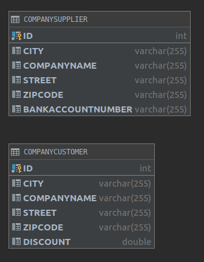

SQL podczas tworzenia tabeli i tworzenia encji obu subklas:
```
Hibernate: 
    
    create table CompanyCustomer (
       id integer not null,
        city varchar(255),
        companyName varchar(255),
        street varchar(255),
        zipCode varchar(255),
        discount double,
        primary key (id)
    )
Hibernate: 
    
    create table CompanySupplier (
       id integer not null,
        city varchar(255),
        companyName varchar(255),
        street varchar(255),
        zipCode varchar(255),
        bankAccountNumber varchar(255),
        primary key (id)
    )

Hibernate: 
    /* insert inheritance.tablePerClass.CompanyCustomer
        */ insert 
        into
            CompanyCustomer
            (city, companyName, street, zipCode, discount, id) 
        values
            (?, ?, ?, ?, ?, ?)
Hibernate: 
    /* insert inheritance.tablePerClass.CompanySupplier
        */ insert 
        into
            CompanySupplier
            (city, companyName, street, zipCode, bankAccountNumber, id) 
        values
            (?, ?, ?, ?, ?, ?)
```

# II. Projekt

Aby uruchomić projekt należy:

1. Uruchomić serwer bazodanowy Apache Derby na porcie lokalnym 1527.

2. Uruchomić aplikację serwerową z `ReactiveCrudbernateApp` (lub konfiguracja StartAll)

2. Uruchomić aplikację kliencką z folderu `frondcrudate` poleceniem `yarn start` (lub konfiguracja StartAll)

## Krótki opis

Aplikacja napisana w ramach projektu z JPA/Hibernate to aplikacja webowa, składająca się z dwóch części.

Po stronie frontendu jest prosta aplikacja kliencka napisana w **React**'cie z wykorzystaniem **Typescript**'a.
Do komunikacji z bazą danych (Apache Derby) - za pośrednictwem aplikacji serwerowej wykorzystuje ona **REST**owe API.

Z kolei po stronie backendu stoi aplikacja napisana w **Javie** z wykorzystaniem m.in **Spring Boot**'a, **JPA** i **Hibernate**'a.

Celem przyspieszenia developementu i redukcji ilości boilerplate'owego kodu wykorzystano także pomocną bibliotekę Javową - **Lombok**.

Aplikacja pozwala na wysyłanie CRUDowych zapytań (tworzenie, modyfikacja i usuwanie danych). Tematycznie umożliwia ona obsługę sklepu, składanie zamówień, dodawanie produktów i grupowanie ich w kategorie.

## A. Część frontend'owa

Aplikacja kliencka nie jest głównym przedmiotem tego mini-projektu, ale warto po krótce opisać jak wygląda oraz jak działa.

Po uruchomieniu aplikacji należy wejść na: [http://localhost:3000/](http://localhost:3000/)
Pojawiamy się na stronie głównej gdzie mamy dostępnych kilka linków.

Dla każdej obsługiwanej encji bazodanowej aplikacja umożliwia wyświetlanie rekordów w przejrzystej formie, tryb edycji i tworzenia nowej encji oraz przycisk do usuwania encji z bazy.

Wykorzystane do tego zostały generyczne komponenty: **ListComponent** oraz **ListEditorComponent**.

Konfiguracje dla poszczególnych encji zawarte są w pliku _ListConfigs.ts_

Przykładowe screenshoty:

1: Menu główne


2: Zakładka dla zamówień

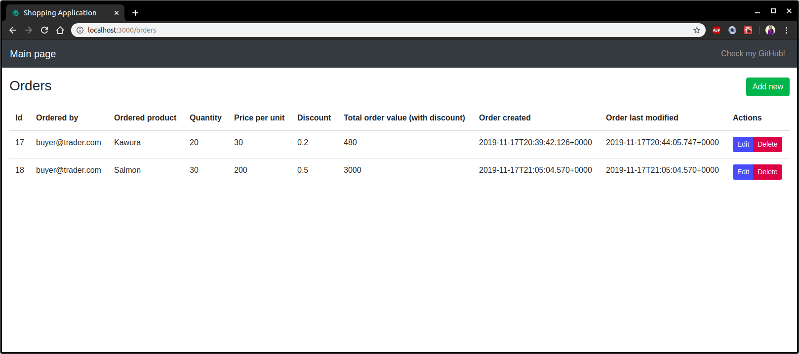

3: Kreator nowego zamówienia

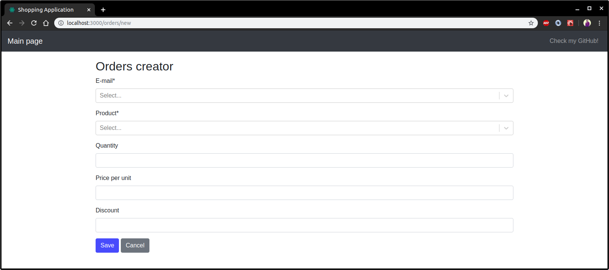

4: Kreator nowego zamówienia cd. (wybór wartości klucza obcego)

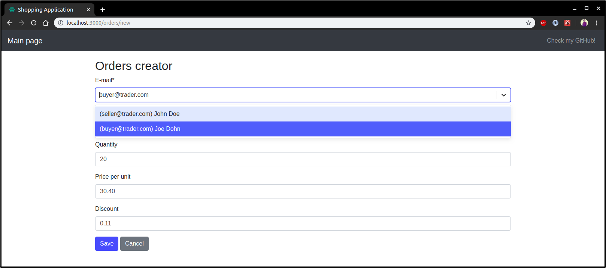

5: Kreator kategorii

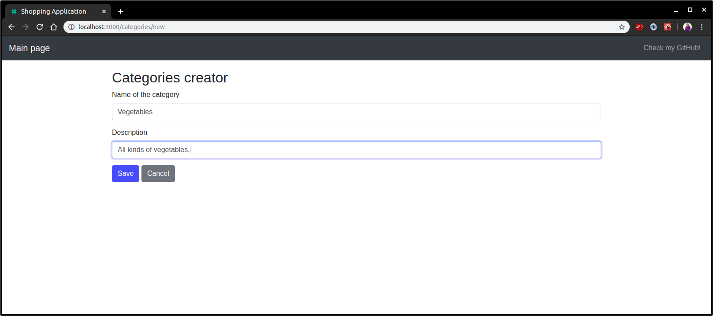

6: Widok klientów

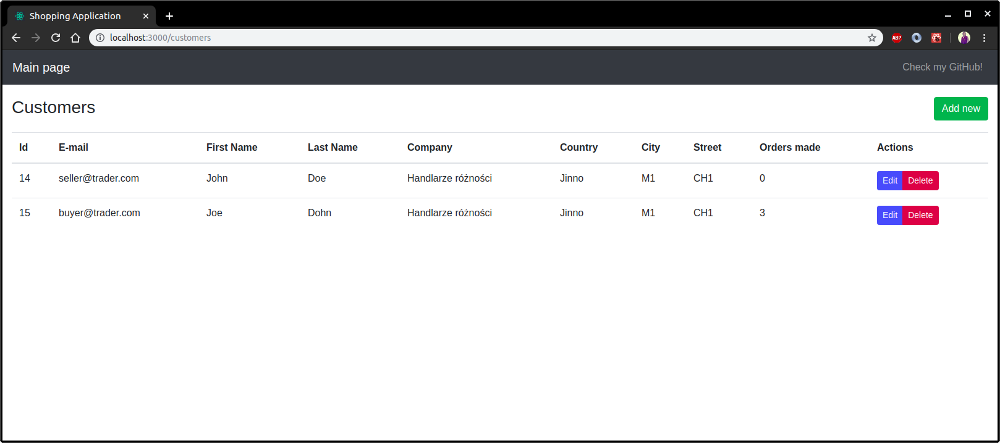

## B. Część backend'owa (JPA + Spring)

Opis wykorzystanych mechanizmów z JPA i/lub modułu Spring Data.

## 1. Konfiguracja źródła danych

Konfigurujemy Bean'a który stanowi jedyne źródło danych dla naszego projektu.

```java
@Configuration
public class DataSourceConfig {

    @Bean
    public DataSource getDataSource() {
        return DataSourceBuilder
                .create()
                .url("jdbc:derby://localhost:1527/DerbyDatabase;create=true")
                .driverClassName("org.apache.derby.jdbc.ClientDriver")
                .build();
    }
}
```

Dodajemy też w pliku `application.properties` informację jak wykonywać zapytania DDL oraz jakiego dialektu bazodanowego należy użyć.

```properties
spring.jpa.properties.hibernate.dialect=org.hibernate.dialect.DerbyTenSevenDialect
spring.jpa.hibernate.ddl-auto=create
```

Dwa powyższe wraz z domyślnymi ustawieniami Spring Boot'a w zupełności wystarczają do nawiązania połączenia z bazą danych.

Samą bazę Apache Derby uruchamiamy z opcjami:

`./startNetworkServer -h localhost -noSecurityManager`

## 2. Model bazodanowy

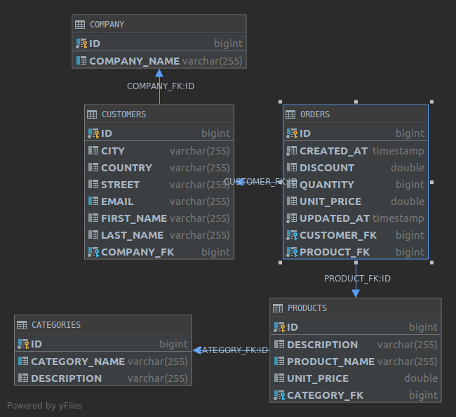

Model stanowi rozbudowany modelu utworzonego w ramach części pierwszej zadania.

Zmodyfikowane zostało kilka pól w tabelach Orders, Products i Customers, a także utworzono nową tabelę: Company.

Wszystkie klasy z `@Entity` bedą dostępne w katalogu z kodem źródłowym. Poniżej krótki komentarz do wybranych z nich, wymagających słowa opisu.

#### 2.1. Customer oraz Address

Tabela Customers zawiera unikalny indeks na polu `email`.

W tej, jak i niektórych innych klasach wykorzystujemy adnotacje `@JsonIgnore, @JsonUnwrapped`, aby kontrolować które pola i w jaki sposób są serializowane/deserializowane.

Można powiedzieć że klasa ta stanowi zarówno DAO jak i DTO.

Adnotacją `@Transient` oznaczamy pola używane wyłącznie przy serializacji, które nie chcemy aby były odwzorowywane w bazie.

Wykorzystujemy także `@Embedded` celem 'osadzenia' w tabeli adresu, będącego osobną klasą w modelu obiektowym. 

##### 2.1.1. orhpanRemoval

Opcja orphanRemoval dostępna w JPA > 2.0 pozwala na usuwanie z bazy encji, których klucze obce wskazują na nieistniejące obiekty.

```java
@Data
@Builder
@AllArgsConstructor
@NoArgsConstructor
@EqualsAndHashCode(exclude = {"company", "orders"})
@ToString(exclude = {"company"})
@Entity
@Table(name = "Customers")
public class Customer {
    @Id
    @GeneratedValue
    private Long id;

    private String firstName;

    private String lastName;

    @Column(unique = true)
    private String email;

    @JsonUnwrapped
    @Embedded
    private Address address;

    @JsonIgnore
    @ManyToOne(optional = false)
    @JoinColumn(name = "COMPANY_FK")
    private Company company;

    @JsonIgnore
    @OneToMany(fetch = FetchType.EAGER, cascade = CascadeType.ALL, mappedBy = "customer", orphanRemoval = true)
    private Set<Order> orders;

    @Transient
    private String companyName;

    @Transient
    private Integer ordersCount;

    public void setTransientFields() {
        companyName = company == null ? null : company.getCompanyName();
        ordersCount = orders == null ? 0 : orders.size();
    }
}
```

Wykorzystana klasa `Address`:

```java
@Data
@Builder
@NoArgsConstructor
@AllArgsConstructor
@Embeddable
public class Address {
    private String city;
    private String country;
    private String street;
}
```

#### 2.2. Orders

##### 2.2.1. EntityListeners i @EnableJpaAuditing

Tabelę Orders wyróżnia to, że rekordy w niej będą zawierały datę utworzenia encji i datę ostatniej modyfikacji.

Aktualizacją tych dwóch pól zarządza automatycznie JPA. 

Oznacza to że przy tworzeniu nowego rekordu, jego pole z adnotacją `@CreatedDate` zostanie automatycznie ustawione na czas jego utworzenia, a `@LastModifiedDate` będzie aktualizowane przy każdej kolejnej operacji modyfikacji.

Aby uruchomić ten mechanizm definiujemy nad klasą która ma być w ten sposób przetwarzana adnotację:
 `@EntityListeners(AuditingEntityListener.class)`
 a nad odpowiednimi polami `@CreatedDate` i `@LastModifiedDate`.
 
 Dodatkowo, dodajemy adnotację `@EnableJpaAuditing` nad klasą z main'em:
 
 ```java
@SpringBootApplication
@EnableJpaAuditing
public class ReactiveCrudbernateApplication {
	public static void main(String[] args) {
		SpringApplication.run(ReactiveCrudbernateApplication.class, args);
	}
}
```
 
 Oprócz tego używamy adnotacji `@IgnoreJsonProperties` z opcją `allowGetters` ponieważ nie chcemy, aby te pola były brane pod uwagę podczas deserializacji, ale chcemy je przesyłać na front przy serializacji.
 
##### 2.2.2. Temporal
 Adnotacje `@Temporal(TemporalType.Timestamp)` instruują JPA w jaki sposób powinny zostać zmapowane pola o typie `Date`. W przypadku dat modyfikacji sam dzień może być niewystarczjący dlatego chcemy aby w bazie przechowywane były pełne timestamp'y.
 
 Przykład z tabeli Orders:
 
 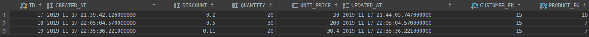
 
Kod klasy:

```java
@Data
@Builder
@AllArgsConstructor
@NoArgsConstructor
@EqualsAndHashCode(exclude = {"product", "customer"})
@ToString(exclude = {"product", "customer"})
@JsonIgnoreProperties(value = {"createdAt", "updatedAt"}, allowGetters = true)
@EntityListeners(AuditingEntityListener.class)
@Entity
@Table(name = "Orders")
public class Order {
    @Id
    @GeneratedValue
    private Long id;

    @JsonIgnore
    @ManyToOne(optional = false)
    @JoinColumn(name = "PRODUCT_FK")
    private Product product;

    @JsonIgnore
    @ManyToOne(optional = false)
    @JoinColumn(name = "CUSTOMER_FK")
    private Customer customer;

    @JsonProperty(required = true)
    private Double unitPrice;

    @JsonProperty(required = true)
    private Double discount;

    @JsonProperty(required = true)
    private Long quantity;

    @Column(nullable = false, updatable = false)
    @Temporal(TemporalType.TIMESTAMP)
    @CreatedDate
    private Date createdAt;

    @Column(nullable = false)
    @Temporal(TemporalType.TIMESTAMP)
    @LastModifiedDate
    private Date updatedAt;

    @Transient
    private String productName;

    @Transient
    private String customerEmail;

    @Transient
    private Double totalValue;

    public void setTransientFields() {
        customerEmail = customer == null ? null : customer.getEmail();
        productName = product == null ? null : product.getProductName();
        totalValue = unitPrice * quantity * (1 - discount);
    }
}
```

#### 2.3. Pozostałe

Pozostałe klasy nie zawierają innych 'mechanizmów' niż te opisane powyżej, dlatego też nie ma sensu ich tutaj umieszczać.
Schemat BD wystarczająco opisuje zależności pomiędzy nimi zachodzące.

## 3. Repozytoria

Jedną z największych zalet Spring Boot'a jest to że zwalnia on programistę z konieczności pisania sporych ilości powtarzalnego (boilerplate) kodu.

Przykładową zaletą korzystania ze Spring Data jest prostota definiowania interfejsów dostępu do danych.

#### 3.1. JpaRepository<T, ID>

Celem zdefiniowania najprostszego repozytorium, wykorzystującego pod spodem JPA i wcześniej utworzoną konfigurację, aby uzyskać dostęp do danych, jest interfejs generyczny `JpaRepository`.

za parametr `T` podajemy klasę do persystencji (np. Category)

za parametr `ID` podajemy typ klucza głównego persystowanego obiektu (np. Long)

Przykład: 

```java
public interface CategoryRepository extends JpaRepository<Category, Long> {}
```

Tak zdefiniowany interfejs jest gotowy do użytku i pozwala na szukanie Categorii m.in po nazwie, usuwanie, modyfikacje i tym podobne.

Chcąc dodać dodatkowe metody, możemy wykorzystać słowa klucze w nazwach metod i odpowiednie implementacje zostaną same wygenerowane.

Przykładowo zdefiniujmy w powyższym interfejsie metodę:

`List<Category> findByCategoryNameContainingIgnoreCase(String categoryName);`

Nie podając dodatkowej implementacji tak zdefiniowana metoda jest gotowa do użytku (działanie poniżej).
Wyszuka ona w bazie danych wszystkie kategorie zawierające w nazwie wartość parametru `categoryName`, ignorując wielkość liter.

Przykład działania:

```
= Categories found with findAll() =
Category(id=1, categoryName=Tea, description=null, products=[])
Category(id=2, categoryName=Coffee, description=null, products=[])
Category(id=3, categoryName=Alcohol, description=null, products=[])
Category(id=4, categoryName=Fish, description=null, products=[Product(id=7, productName=Salmon, description=Tasty salmon, unitPrice=null, categoryName=null), Product(id=8, productName=Tuna, description=Stinky tuna, unitPrice=null, categoryName=null)])
Category(id=5, categoryName=Food, description=null, products=[])
Category(id=6, categoryName=Fancy outfits, description=null, products=[])


= Categories starting with 'F' =
Category(id=4, categoryName=Fish, description=null, products=[Product(id=7, productName=Salmon, description=Tasty salmon, unitPrice=null, categoryName=null), Product(id=8, productName=Tuna, description=Stinky tuna, unitPrice=null, categoryName=null)])
Category(id=5, categoryName=Food, description=null, products=[])
Category(id=6, categoryName=Fancy outfits, description=null, products=[])


= Categories containing 'f' =
Category(id=2, categoryName=Coffee, description=null, products=[])
Category(id=4, categoryName=Fish, description=null, products=[Product(id=7, productName=Salmon, description=Tasty salmon, unitPrice=null, categoryName=null), Product(id=8, productName=Tuna, description=Stinky tuna, unitPrice=null, categoryName=null)])
Category(id=5, categoryName=Food, description=null, products=[])
Category(id=6, categoryName=Fancy outfits, description=null, products=[])
```

Inne przykłady metod z **gotową** implementacją:

```
List<Category> findByCategoryName(String categoryName);

List<Category> findByCategoryNameStartingWith(String categoryName);

List<Category> findByCategoryNameEndingWith(String categoryName);
```

#### 3.2. JPQL - Java Persistence Query Language

Możemy również zdefiniować w prosty sposób nasze własne, bardziej niestandardowe zapytania, wykorzystując do tego JPQL.

Przykład dla CategoryRepository - znajdź wszystkie kategorie rozpoczynające się od:

```
@Query("SELECT c FROM Category AS c WHERE c.categoryName LIKE CONCAT(?1, '%')")
List<Category> findByPrefix(String categoryName);
```

Przykład dla OrderRepository - znajdź wszystkie zamówienia złożone wcześniej niż:

```
@Query("SELECT o FROM Order AS o WHERE o.createdAt < ?1")
List<Order> findOlderThan(Date date);
```

## 4. API i @RestController

Na każdą tabelę bazodanową odwzorowaną po stronie klienta utworzono osobny `RestController`, który jednak wygląda podobnie w każdym przypadku dlatego skomentuję tutaj tylko jeden z nich.

#### 4.1. Logi operacji

Dla każdej wykonywanej na bazie danych operacji chcemy logować przychodzące requesty.
W tym celu wykorzystujemy metodę `Logger.info()`.

#### 4.2. Zapis / odczyt / aktualizacja

Jak widać poniżej celem wszystkie operacje odbywają się za pośrednictwem wcześniej omówionych repozytoriów, które są automatycznie wstrzykiwane przez konstruktor do klasy kontrolera.

Zgodnie z standardami restowymi wykorzystujemy:

GET - pobieranie danych (wszystkich lub pojednczej encji po jej identyfikatorze)

POST - tworzenie nowej encji

PUT - aktualizacja istniejącej encji

DELETE - usuwanie encji po jej identyfikatorze
```java
@RestController
@RequestMapping("/API/customers")
public class CustomerController {
    private final Logger log = LoggerFactory.getLogger(CustomerController.class);

    private final CustomerRepository customerRepository;

    private final CompanyRepository companyRepository;

    public CustomerController(CustomerRepository customerRepository, CompanyRepository companyRepository) {
        this.customerRepository = customerRepository;
        this.companyRepository = companyRepository;
    }

    @GetMapping("/all")
    Collection<Customer> getAll() {
        List<Customer> allCustomers = customerRepository.findAll();
        allCustomers.forEach(Customer::setTransientFields);
        return allCustomers;
    }

    @GetMapping("/{customerId}")
    ResponseEntity<?> getById(@PathVariable Long customerId) {
        Optional<Customer> customerOpt = customerRepository.findById(customerId);
        customerOpt.ifPresent(Customer::setTransientFields);
        return customerOpt
                .map(customer -> ResponseEntity.ok().body(customer))
                .orElse(new ResponseEntity<>(HttpStatus.NOT_FOUND));
    }

    @PostMapping
    ResponseEntity<Customer> create(@Valid @RequestBody Customer customer) throws URISyntaxException {
        log.info("Request to create new customer: {}", customer);
        Company company = companyRepository.findByCompanyName(customer.getCompanyName());
        customer.setCompany(company);

        customerRepository.save(customer);
        return ResponseEntity.ok().body(customer);
    }

    @PutMapping
    ResponseEntity<Customer> update(@Valid @RequestBody Customer customer) throws URISyntaxException {
        log.info("Request to update customer: {}", customer);
        Company company = companyRepository.findByCompanyName(customer.getCompanyName());
        customer.setCompany(company);

        customerRepository.save(customer);
        return ResponseEntity.ok().body(customer);
    }

    @DeleteMapping("/{customerId}")
    ResponseEntity<?> delete(@PathVariable Long customerId) {
        log.info("Request to delete customer with ID: {}", customerId);

        customerRepository
                .findById(customerId)
                .flatMap(customer -> companyRepository.findById(customer.getCompany().getId()))
                .ifPresent(company -> {
                    company.getEmployees().removeIf(customer -> customer.getId().equals(customerId));
                    companyRepository.save(company);
                });

        return ResponseEntity.ok().build();
    }
}
```