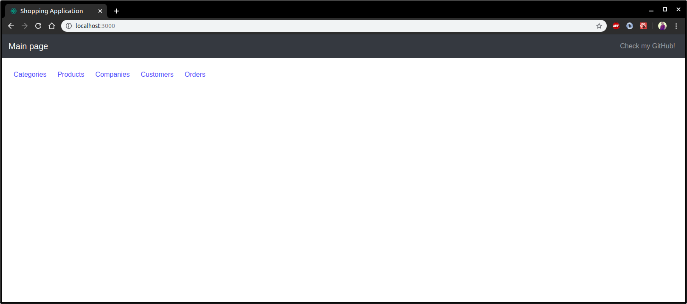

# II. Projekt

Aby uruchomić projekt należy:

1. Uruchomić serwer bazodanowy Apache Derby na porcie lokalnym 1527.

2. Uruchomić aplikację serwerową z `ReactiveCrudbernateApp` (lub konfiguracja StartAll)

2. Uruchomić aplikację kliencką z folderu `frondcrudate` poleceniem `yarn start` (lub konfiguracja StartAll)

## Krótki opis

Aplikacja napisana w ramach projektu z JPA/Hibernate to aplikacja webowa, składająca się z dwóch części.

Po stronie frontendu jest prosta aplikacja kliencka napisana w **React**'cie z wykorzystaniem **Typescript**'a.
Do komunikacji z bazą danych (Apache Derby) - za pośrednictwem aplikacji serwerowej wykorzystuje ona **REST**owe API.

Z kolei po stronie backendu stoi aplikacja napisana w **Javie** z wykorzystaniem m.in **Spring Boot**'a, **JPA** i **Hibernate**'a.

Celem przyspieszenia developementu i redukcji ilości boilerplate'owego kodu wykorzystano także pomocną bibliotekę Javową - **Lombok**.

Aplikacja pozwala na wysyłanie CRUDowych zapytań (tworzenie, modyfikacja i usuwanie danych). Tematycznie umożliwia ona obsługę sklepu, składanie zamówień, dodawanie produktów i grupowanie ich w kategorie.

## A. Część frontend'owa

Aplikacja kliencka nie jest głównym przedmiotem tego mini-projektu, ale warto po krótce opisać jak wygląda oraz jak działa.

Po uruchomieniu aplikacji należy wejść na: [http://localhost:3000/](http://localhost:3000/)
Pojawiamy się na stronie głównej gdzie mamy dostępnych kilka linków.

Dla każdej obsługiwanej encji bazodanowej aplikacja umożliwia wyświetlanie rekordów w przejrzystej formie, tryb edycji i tworzenia nowej encji oraz przycisk do usuwania encji z bazy.

Wykorzystane do tego zostały generyczne komponenty: **ListComponent** oraz **ListEditorComponent**.

Konfiguracje dla poszczególnych encji zawarte są w pliku _ListConfigs.ts_

Przykładowe screenshoty:

1: Menu główne



2: Zakładka dla zamówień


3: Kreator nowego zamówienia


4: Kreator nowego zamówienia cd. (wybór wartości klucza obcego)


5: Kreator kategorii


6: Widok klientów


## B. Część backend'owa (JPA + Spring)

Opis wykorzystanych mechanizmów z JPA i/lub modułu Spring Data.

## 1. Konfiguracja źródła danych

Konfigurujemy Bean'a który stanowi jedyne źródło danych dla naszego projektu.

```java
@Configuration
public class DataSourceConfig {

    @Bean
    public DataSource getDataSource() {
        return DataSourceBuilder
                .create()
                .url("jdbc:derby://localhost:1527/DerbyDatabase;create=true")
                .driverClassName("org.apache.derby.jdbc.ClientDriver")
                .build();
    }
}
```

Dodajemy też w pliku `application.properties` informację jak wykonywać zapytania DDL oraz jakiego dialektu bazodanowego należy użyć.

```properties
spring.jpa.properties.hibernate.dialect=org.hibernate.dialect.DerbyTenSevenDialect
spring.jpa.hibernate.ddl-auto=create
```

Dwa powyższe wraz z domyślnymi ustawieniami Spring Boot'a w zupełności wystarczają do nawiązania połączenia z bazą danych.

Samą bazę Apache Derby uruchamiamy z opcjami:

`./startNetworkServer -h localhost -noSecurityManager`

## 2. Model bazodanowy


Model stanowi rozbudowany modelu utworzonego w ramach części pierwszej zadania.

Zmodyfikowane zostało kilka pól w tabelach Orders, Products i Customers, a także utworzono nową tabelę: Company.

Wszystkie klasy z `@Entity` bedą dostępne w katalogu z kodem źródłowym. Poniżej krótki komentarz do wybranych z nich, wymagających słowa opisu.

#### 2.1. Customer oraz Address

Tabela Customers zawiera unikalny indeks na polu `email`.

W tej, jak i niektórych innych klasach wykorzystujemy adnotacje `@JsonIgnore, @JsonUnwrapped`, aby kontrolować które pola i w jaki sposób są serializowane/deserializowane.

Można powiedzieć że klasa ta stanowi zarówno DAO jak i DTO.

Adnotacją `@Transient` oznaczamy pola używane wyłącznie przy serializacji, które nie chcemy aby były odwzorowywane w bazie.

Wykorzystujemy także `@Embedded` celem 'osadzenia' w tabeli adresu, będącego osobną klasą w modelu obiektowym. 

##### 2.1.1. orhpanRemoval

Opcja orphanRemoval dostępna w JPA > 2.0 pozwala na usuwanie z bazy encji, których klucze obce wskazują na nieistniejące obiekty.

```java
@Data
@Builder
@AllArgsConstructor
@NoArgsConstructor
@EqualsAndHashCode(exclude = {"company", "orders"})
@ToString(exclude = {"company"})
@Entity
@Table(name = "Customers")
public class Customer {
    @Id
    @GeneratedValue
    private Long id;

    private String firstName;

    private String lastName;

    @Column(unique = true)
    private String email;

    @JsonUnwrapped
    @Embedded
    private Address address;

    @JsonIgnore
    @ManyToOne(optional = false)
    @JoinColumn(name = "COMPANY_FK")
    private Company company;

    @JsonIgnore
    @OneToMany(fetch = FetchType.EAGER, cascade = CascadeType.ALL, mappedBy = "customer", orphanRemoval = true)
    private Set<Order> orders;

    @Transient
    private String companyName;

    @Transient
    private Integer ordersCount;

    public void setTransientFields() {
        companyName = company == null ? null : company.getCompanyName();
        ordersCount = orders == null ? 0 : orders.size();
    }
}
```

Wykorzystana klasa `Address`:

```java
@Data
@Builder
@NoArgsConstructor
@AllArgsConstructor
@Embeddable
public class Address {
    private String city;
    private String country;
    private String street;
}
```

#### 2.2. Orders

##### 2.2.1. EntityListeners i @EnableJpaAuditing

Tabelę Orders wyróżnia to, że rekordy w niej będą zawierały datę utworzenia encji i datę ostatniej modyfikacji.

Aktualizacją tych dwóch pól zarządza automatycznie JPA. 

Oznacza to że przy tworzeniu nowego rekordu, jego pole z adnotacją `@CreatedDate` zostanie automatycznie ustawione na czas jego utworzenia, a `@LastModifiedDate` będzie aktualizowane przy każdej kolejnej operacji modyfikacji.

Aby uruchomić ten mechanizm definiujemy nad klasą która ma być w ten sposób przetwarzana adnotację:
 `@EntityListeners(AuditingEntityListener.class)`
 a nad odpowiednimi polami `@CreatedDate` i `@LastModifiedDate`.
 
 Dodatkowo, dodajemy adnotację `@EnableJpaAuditing` nad klasą z main'em:
 
 ```java
@SpringBootApplication
@EnableJpaAuditing
public class ReactiveCrudbernateApplication {
	public static void main(String[] args) {
		SpringApplication.run(ReactiveCrudbernateApplication.class, args);
	}
}
```
 
 Oprócz tego używamy adnotacji `@IgnoreJsonProperties` z opcją `allowGetters` ponieważ nie chcemy, aby te pola były brane pod uwagę podczas deserializacji, ale chcemy je przesyłać na front przy serializacji.
 
##### 2.2.2. Temporal
 Adnotacje `@Temporal(TemporalType.Timestamp)` instruują JPA w jaki sposób powinny zostać zmapowane pola o typie `Date`. W przypadku dat modyfikacji sam dzień może być niewystarczjący dlatego chcemy aby w bazie przechowywane były pełne timestamp'y.
 
 Przykład z tabeli Orders:
 
 
 
Kod klasy:

```java
@Data
@Builder
@AllArgsConstructor
@NoArgsConstructor
@EqualsAndHashCode(exclude = {"product", "customer"})
@ToString(exclude = {"product", "customer"})
@JsonIgnoreProperties(value = {"createdAt", "updatedAt"}, allowGetters = true)
@EntityListeners(AuditingEntityListener.class)
@Entity
@Table(name = "Orders")
public class Order {
    @Id
    @GeneratedValue
    private Long id;

    @JsonIgnore
    @ManyToOne(optional = false)
    @JoinColumn(name = "PRODUCT_FK")
    private Product product;

    @JsonIgnore
    @ManyToOne(optional = false)
    @JoinColumn(name = "CUSTOMER_FK")
    private Customer customer;

    @JsonProperty(required = true)
    private Double unitPrice;

    @JsonProperty(required = true)
    private Double discount;

    @JsonProperty(required = true)
    private Long quantity;

    @Column(nullable = false, updatable = false)
    @Temporal(TemporalType.TIMESTAMP)
    @CreatedDate
    private Date createdAt;

    @Column(nullable = false)
    @Temporal(TemporalType.TIMESTAMP)
    @LastModifiedDate
    private Date updatedAt;

    @Transient
    private String productName;

    @Transient
    private String customerEmail;

    @Transient
    private Double totalValue;

    public void setTransientFields() {
        customerEmail = customer == null ? null : customer.getEmail();
        productName = product == null ? null : product.getProductName();
        totalValue = unitPrice * quantity * (1 - discount);
    }
}
```

#### 2.3. Pozostałe

Pozostałe klasy nie zawierają innych 'mechanizmów' niż te opisane powyżej, dlatego też nie ma sensu ich tutaj umieszczać.
Schemat BD wystarczająco opisuje zależności pomiędzy nimi zachodzące.

## 3. Repozytoria

Jedną z największych zalet Spring Boot'a jest to że zwalnia on programistę z konieczności pisania sporych ilości powtarzalnego (boilerplate) kodu.

Przykładową zaletą korzystania ze Spring Data jest prostota definiowania interfejsów dostępu do danych.

#### 3.1. JpaRepository<T, ID>

Celem zdefiniowania najprostszego repozytorium, wykorzystującego pod spodem JPA i wcześniej utworzoną konfigurację, aby uzyskać dostęp do danych, jest interfejs generyczny `JpaRepository`.

za parametr `T` podajemy klasę do persystencji (np. Category)

za parametr `ID` podajemy typ klucza głównego persystowanego obiektu (np. Long)

Przykład: 

```java
public interface CategoryRepository extends JpaRepository<Category, Long> {}
```

Tak zdefiniowany interfejs jest gotowy do użytku i pozwala na szukanie Categorii m.in po nazwie, usuwanie, modyfikacje i tym podobne.

Chcąc dodać dodatkowe metody, możemy wykorzystać słowa klucze w nazwach metod i odpowiednie implementacje zostaną same wygenerowane.

Przykładowo zdefiniujmy w powyższym interfejsie metodę:

`List<Category> findByCategoryNameContainingIgnoreCase(String categoryName);`

Nie podając dodatkowej implementacji tak zdefiniowana metoda jest gotowa do użytku (działanie poniżej).
Wyszuka ona w bazie danych wszystkie kategorie zawierające w nazwie wartość parametru `categoryName`, ignorując wielkość liter.

Przykład działania:

```
= Categories found with findAll() =
Category(id=1, categoryName=Tea, description=null, products=[])
Category(id=2, categoryName=Coffee, description=null, products=[])
Category(id=3, categoryName=Alcohol, description=null, products=[])
Category(id=4, categoryName=Fish, description=null, products=[Product(id=7, productName=Salmon, description=Tasty salmon, unitPrice=null, categoryName=null), Product(id=8, productName=Tuna, description=Stinky tuna, unitPrice=null, categoryName=null)])
Category(id=5, categoryName=Food, description=null, products=[])
Category(id=6, categoryName=Fancy outfits, description=null, products=[])


= Categories starting with 'F' =
Category(id=4, categoryName=Fish, description=null, products=[Product(id=7, productName=Salmon, description=Tasty salmon, unitPrice=null, categoryName=null), Product(id=8, productName=Tuna, description=Stinky tuna, unitPrice=null, categoryName=null)])
Category(id=5, categoryName=Food, description=null, products=[])
Category(id=6, categoryName=Fancy outfits, description=null, products=[])


= Categories containing 'f' =
Category(id=2, categoryName=Coffee, description=null, products=[])
Category(id=4, categoryName=Fish, description=null, products=[Product(id=7, productName=Salmon, description=Tasty salmon, unitPrice=null, categoryName=null), Product(id=8, productName=Tuna, description=Stinky tuna, unitPrice=null, categoryName=null)])
Category(id=5, categoryName=Food, description=null, products=[])
Category(id=6, categoryName=Fancy outfits, description=null, products=[])
```

Inne przykłady metod z **gotową** implementacją:

```
List<Category> findByCategoryName(String categoryName);

List<Category> findByCategoryNameStartingWith(String categoryName);

List<Category> findByCategoryNameEndingWith(String categoryName);
```

#### 3.2. JPQL - Java Persistence Query Language

Możemy również zdefiniować w prosty sposób nasze własne, bardziej niestandardowe zapytania, wykorzystując do tego JPQL.

Przykład dla CategoryRepository - znajdź wszystkie kategorie rozpoczynające się od:

```
@Query("SELECT c FROM Category AS c WHERE c.categoryName LIKE CONCAT(?1, '%')")
List<Category> findByPrefix(String categoryName);
```

Przykład dla OrderRepository - znajdź wszystkie zamówienia złożone wcześniej niż:

```
@Query("SELECT o FROM Order AS o WHERE o.createdAt < ?1")
List<Order> findOlderThan(Date date);
```

## 4. API i @RestController

Na każdą tabelę bazodanową odwzorowaną po stronie klienta utworzono osobny `RestController`, który jednak wygląda podobnie w każdym przypadku dlatego skomentuję tutaj tylko jeden z nich.

#### 4.1. Logi operacji

Dla każdej wykonywanej na bazie danych operacji chcemy logować przychodzące requesty.
W tym celu wykorzystujemy metodę `Logger.info()`.

#### 4.2. Zapis / odczyt / aktualizacja

Jak widać poniżej celem wszystkie operacje odbywają się za pośrednictwem wcześniej omówionych repozytoriów, które są automatycznie wstrzykiwane przez konstruktor do klasy kontrolera.

Zgodnie z standardami restowymi wykorzystujemy:

GET - pobieranie danych (wszystkich lub pojednczej encji po jej identyfikatorze)

POST - tworzenie nowej encji

PUT - aktualizacja istniejącej encji

DELETE - usuwanie encji po jej identyfikatorze
```java
@RestController
@RequestMapping("/API/customers")
public class CustomerController {
    private final Logger log = LoggerFactory.getLogger(CustomerController.class);

    private final CustomerRepository customerRepository;

    private final CompanyRepository companyRepository;

    public CustomerController(CustomerRepository customerRepository, CompanyRepository companyRepository) {
        this.customerRepository = customerRepository;
        this.companyRepository = companyRepository;
    }

    @GetMapping("/all")
    Collection<Customer> getAll() {
        List<Customer> allCustomers = customerRepository.findAll();
        allCustomers.forEach(Customer::setTransientFields);
        return allCustomers;
    }

    @GetMapping("/{customerId}")
    ResponseEntity<?> getById(@PathVariable Long customerId) {
        Optional<Customer> customerOpt = customerRepository.findById(customerId);
        customerOpt.ifPresent(Customer::setTransientFields);
        return customerOpt
                .map(customer -> ResponseEntity.ok().body(customer))
                .orElse(new ResponseEntity<>(HttpStatus.NOT_FOUND));
    }

    @PostMapping
    ResponseEntity<Customer> create(@Valid @RequestBody Customer customer) throws URISyntaxException {
        log.info("Request to create new customer: {}", customer);
        Company company = companyRepository.findByCompanyName(customer.getCompanyName());
        customer.setCompany(company);

        customerRepository.save(customer);
        return ResponseEntity.ok().body(customer);
    }

    @PutMapping
    ResponseEntity<Customer> update(@Valid @RequestBody Customer customer) throws URISyntaxException {
        log.info("Request to update customer: {}", customer);
        Company company = companyRepository.findByCompanyName(customer.getCompanyName());
        customer.setCompany(company);

        customerRepository.save(customer);
        return ResponseEntity.ok().body(customer);
    }

    @DeleteMapping("/{customerId}")
    ResponseEntity<?> delete(@PathVariable Long customerId) {
        log.info("Request to delete customer with ID: {}", customerId);

        customerRepository
                .findById(customerId)
                .flatMap(customer -> companyRepository.findById(customer.getCompany().getId()))
                .ifPresent(company -> {
                    company.getEmployees().removeIf(customer -> customer.getId().equals(customerId));
                    companyRepository.save(company);
                });

        return ResponseEntity.ok().build();
    }
}
```